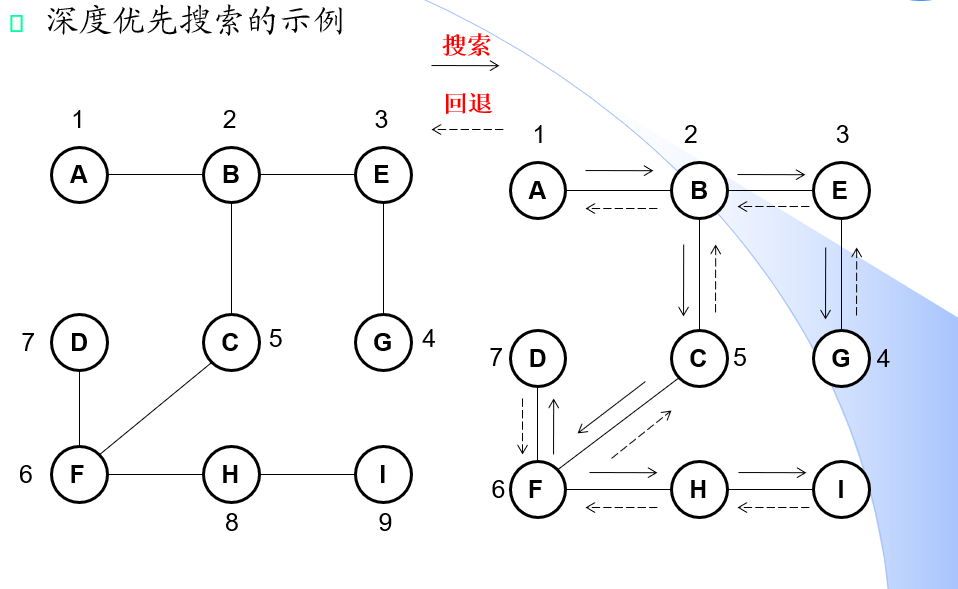

# 深度优先遍历
深度优先遍历的主要思想可以这样概括：
1. 从起点出发，一直向下走，走到终点停止。
2. 往前回退一步，看看该节点周围有没有其他结点没有访问，如果有，则访问此结点，之后再从此结点出发，进行与前述类似的访问；如果没有，就再退回一步进行搜索。
3. 重复上述过程，直到所有结点都被访问过。

**深度优先遍历本质是回溯的思想。**

思路还是直接容易理解的，核心思想也很朴素。DFS常见的应用有：
- 图的深度优先遍历（需要走完图里面的**全部**结点）
- 找路径问题（需要找到是否有这样一条路径，能够到达终点）

## 图的DFS遍历 && 树的DFS遍历
  

虽然思想都是回溯，但是在解决具体的问题是也有细节上的区别，下面我们来看看利用回溯解决找路径类的问题算法框架：
```
// 这是回溯算法的递归实现
Algorithm DFS_main{
    for k=0 to n-1 do
        visited[k] = 0; //创立一个标记数组，用来标识结点是否已经访问过

    DFS(0, visited) // 从结点开始访问
}

// DFS
Algorithm DFS(head, v, visited){
    if v=null then // 到达终止条件，即递归出口
        return;

    if (v.next != null && visited[v.next] != 1) // 访问v的下一个结点
        visit[v.next] = 1;
        DFS(v.next, visited) // 递归访问
        visit[v.next] = 0; // 回溯
}
```
**例题具体代码可去[README.md](../../README.md)去对应题号查看:**
1. 入门级例题:  

题目名称|说明
:------|:---
[133. 克隆图](https://leetcode.cn/problems/clone-graph/)|涉及图的遍历与表示

2. 进阶级例题:  

题目名称|说明
:------|:---
[802. 找到最终的安全状态](https://leetcode.cn/problems/find-eventual-safe-states/)|标准的深度优先遍历，妙就妙在多设置了一个状态

3. BOSS级例题:  

题目名称|说明
:------|:---


# 回溯
1. 入门级例题:  

题目名称|说明
:------|:---
[46. 全排列](https://leetcode.cn/problems/permutations/)|本质是一个树形结构，经典的回溯题
[784. 字母大小写全排列](https://leetcode.cn/problems/letter-case-permutation/)|本质是一个树形结构
[78. 子集](https://leetcode.cn/problems/subsets/)|本质是一个树形结构，根据每一个位置的元素选与不选可以看成二叉树
[306. 累加数](https://leetcode.cn/problems/additive-number/)|问题主题是如何选取前两个数，本题回溯更多的是起到验证的作用，同时利用字符串加法解决溢出

2. 进阶级例题:  

通过剪枝过滤掉不符合条件的解，从而降低时间复杂度。
题目名称|说明
:------|:---
[39. 组合总和](https://leetcode.cn/problems/combination-sum/)|找到剪枝条件
[40. 组合总和 II](https://leetcode.cn/problems/combination-sum-ii/)|也是一个树形结构，找到筛选条件
[47. 全排列 II](https://leetcode.cn/problems/permutations-ii/)|[46. 全排列](https://leetcode.cn/problems/permutations/)的进阶题型
[60. 排列序列](https://leetcode.cn/problems/permutation-sequence/)|全排列的题目，找到符合条件的即可，也是剪枝条件
[77. 组合](https://leetcode.cn/problems/combinations/)|利用按照顺序搜索分析出剪枝条件
[90. 子集 II](https://leetcode.cn/problems/subsets-ii/)|[78. 子集](https://leetcode.cn/problems/subsets/)的进阶，本质也是二叉树型的结构，需要剪枝
[473. 火柴拼正方形](https://leetcode.cn/problems/matchsticks-to-square/)|本质是一种树形结构，同时利用剪枝优化时间
[698. 划分为k个相等的子集](https://leetcode.cn/problems/partition-to-k-equal-sum-subsets/)|本质和[473. 火柴拼正方形](https://leetcode.cn/problems/matchsticks-to-square/)相同
[1079. 活字印刷](https://leetcode.cn/problems/letter-tile-possibilities/)|本质是树结构
[1593. 拆分字符串使唯一子字符串的数目最大](https://leetcode.cn/problems/split-a-string-into-the-max-number-of-unique-substrings/)|剪枝条件很容易想，难在问题的转化

1. BOSS级例题:  

题目名称|说明
:------|:---
[679. 24 点游戏](https://leetcode.cn/problems/24-game/)|更好地理解回溯的本质其实就是一种穷举

## 二维平面查找例题:
题目名称|说明
:------|:---
[79. 单词搜索](https://leetcode.cn/problems/word-search/)|岛屿类问题
[130. 被围绕的区域](https://leetcode.cn/problems/surrounded-regions/)|岛屿类问题
[200. 岛屿数量](https://leetcode.cn/problems/number-of-islands/)|岛屿类问题
[417. 太平洋大西洋水流问题](https://leetcode.cn/problems/pacific-atlantic-water-flow/)|迷宫类问题，通过**反向搜索**降低时间复杂度
[529. 扫雷游戏](https://leetcode.cn/problems/minesweeper/)|岛屿类问题，一次有8个方向可以遍历，同时遍历时候需要判断
[694. 不同岛屿的数量](https://leetcode.cn/problems/number-of-distinct-islands/)|岛屿类问题，本质与[200. 岛屿数量](https://leetcode.cn/problems/number-of-islands/)相同
[695. 岛屿的最大面积](https://leetcode.cn/problems/max-area-of-island/)|岛屿类问题
[1020. 飞地的数量](https://leetcode.cn/problems/number-of-enclaves/)|岛屿类问题，与[130. 被围绕的区域](https://leetcode.cn/problems/surrounded-regions/)完全相同
[1254. 统计封闭岛屿的数目](https://leetcode.cn/problems/number-of-closed-islands/)|岛屿类问题，遍历的时候需要进行判断，是[200. 岛屿数量](https://leetcode.cn/problems/number-of-islands/)和[1020. 飞地的数量](https://leetcode.cn/problems/number-of-enclaves/)的综合
[1034. 边界着色](https://leetcode.cn/problems/coloring-a-border/)|岛屿类问题，遍历时候需要根据所给条件判断
[2061. 扫地机器人清扫过的空间个数](https://leetcode.cn/problems/number-of-spaces-cleaning-robot-cleaned/)|本题难点在于确定遍历终止
[剑指 Offer 13. 机器人的运动范围](https://leetcode.cn/problems/ji-qi-ren-de-yun-dong-fan-wei-lcof/)|迷宫类问题，需要根据题意在遍历时判断