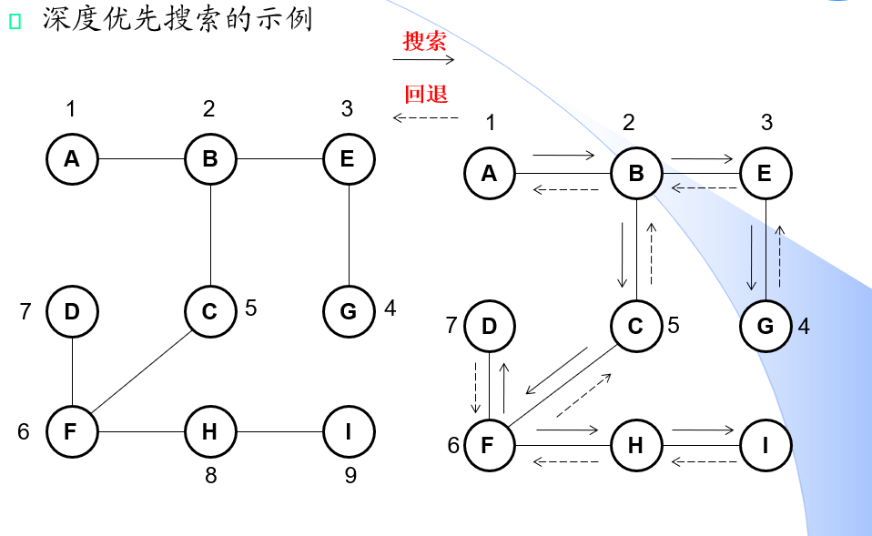

回溯的主要思想可以这样概括：
1. 从起点出发，一直向下走，走到终点停止。
2. 往前回退一步，看看该节点周围有没有其他结点没有访问，如果有，则访问此结点，之后再从此结点出发，进行与前述类似的访问；如果没有，就再退回一步进行搜索。
3. 重复上述过程，直到所有结点都被访问过。

思路还是直接容易理解的，核心思想也很朴素。回溯常见的应用有：
- 图的深度优先遍历（需要走完图里面的**全部**结点）
- 找路径问题（需要找到是否有这样一条路径，能够到达终点）



虽然思想都是回溯，但是在解决具体的问题是也有细节上的区别，下面我们来看看利用回溯解决找路径类的问题算法框架：
```
// 这是回溯算法的递归实现
Algorithm DFS_main{
    for k=0 to n-1 do
        visited[k] = 0; //创立一个标记数组，用来标识结点是否已经访问过

    DFS(0, visited) // 从结点开始访问
}

// DFS
Algorithm DFS(head, v, visited){
    if v=null then // 到达终止条件，即递归出口
        return;

    if (v.next != null && visited[v.next] != 1) // 访问v的下一个结点
        visit[v.next] = 1;
        DFS(v.next, visited) // 递归访问
        visit[v.next] = 0; // 回溯
}
```

例题：62, 63, 64, 76...
具体代码可去[README.md](../../README.md)去对应题号查看